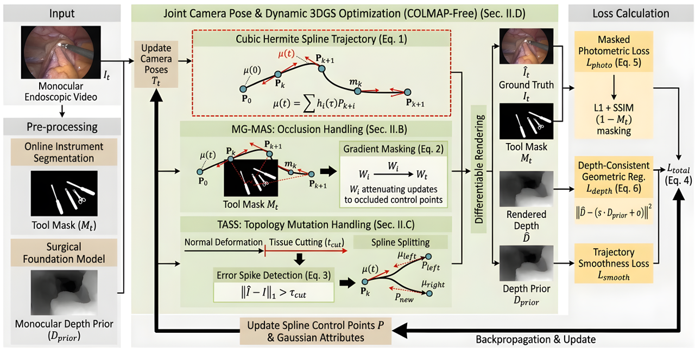

<div><h2>ZT-GS: Zernike Spectral Trajectory Field with Topology-Aware Splitting for Dynamic Endoscopic Reconstruction</h2></div>
<br>

**Qi Chen, Qing Xia, Yang Gao, Shuai Li, Aimin Hao**
State Key Laboratory of Virtual Reality Technology and Systems, Beihang University



**ZT-GS** is a COLMAP-free dynamic 3D Gaussian Splatting framework tailored for monocular endoscopic surgical scenes. It replaces conventional piecewise polynomial trajectory interpolation (cubic Hermite splines) with a global spectral decomposition on a conformally embedded unit disk, enabling frequency disentanglement, analytic differentiability, and compact parameterization. The framework is described in `ZT_GS.pdf`.

## ✨ Key Features

- **Zernike Spectral Trajectory Field (ZSTF)** — Each Gaussian's center trajectory is expanded as a weighted superposition of orthogonal Zernike-Sobolev basis functions on a conformally embedded unit disk (N=6 → 49 modes), replacing cubic Hermite control points. Init via least-squares fitting to 2D tracks (`scene/zernike.py`).
- **Mask-Guided Frequency-Selective Occlusion Handling (MG-TPC)** — Spectral-order-dependent gradient masking that aggressively freezes high-order coefficients under tool occlusion while preserving low-order physiological inertia and anchoring the zero-order centroid (`gaussian_model.py:489`, Eq. 4).
- **Topology-Aware Spectral Splitting (TASS)** — Detects irreversible tissue ruptures via spectral-entropy surges and performs frequency-selective trajectory bifurcation: low-order motion stays shared, high-order motion diverges independently for opposing tissue lips (`gaussian_model.py:528-642`, Eq. 5-7).
- **Cyclic Spatio-Temporal Evolution Paradigm** — Traverses the sequence forward (t=1→T) then backward (t=T→1) per epoch with bidirectional gradient accumulation, refining spectral coefficients from future observations (`train.py`, Eq. 12).
<!-- - **Spectral-Sparsity Loss** — L1 penalty on Zernike coefficients (excluding the zero-order centroid) replaces Hermite-spline second-derivative regularization, pruning redundant high-order modes (`utils/loss_utils.py:221`).
- **Spectral-Anchored Depth Consistency** — Monocular depth prior with a Dirichlet boundary condition anchoring the zeroth spectral moment to physical depth, eliminating scale drift (`utils/loss_utils.py:185`, Eq. 11).
- **Dual-Environment Pipeline** — UniDepth (metric depth) + Depth-Anything (disparity) + CoTracker3 (long-range point tracks) for COLMAP-free geometric initialization. -->

## ⚙️ Environmental Setups

Two conda environments are required (training + depth estimation):

```sh
git clone https://github.com/chenqi111/ZT_GS.git --recursive
cd ZT_GS

# === Environment 1: Main training env (Python 3.7, CUDA 11.7, PyTorch 1.13.1) ===
conda create -n splinegs python=3.7
conda activate splinegs
export CUDA_HOME=$CONDA_PREFIX
export LD_LIBRARY_PATH=$CONDA_PREFIX/lib

conda install pytorch==1.13.1 torchvision==0.14.1 torchaudio==0.13.1 pytorch-cuda=11.7 -c pytorch -c nvidia
conda install nvidia/label/cuda-11.7.0::cuda
conda install nvidia/label/cuda-11.7.0::cuda-nvcc
conda install nvidia/label/cuda-11.7.0::cuda-runtime
conda install nvidia/label/cuda-11.7.0::cuda-cudart

pip install -e submodules/simple-knn
pip install -e submodules/co-tracker
pip install -r requirements.txt

# === Environment 2: Depth estimation env (Python 3.10, CUDA 12.1, PyTorch 2.4) ===
conda deactivate
conda create -n unidepth_splinegs python=3.10
conda activate unidepth_splinegs

pip install -r requirements_unidepth.txt
conda install -c conda-forge ld_impl_linux-64
export CUDA_HOME=$CONDA_PREFIX
export LD_LIBRARY_PATH=$CONDA_PREFIX/lib
conda install nvidia/label/cuda-12.1.0::cuda
conda install nvidia/label/cuda-12.1.0::cuda-nvcc
conda install nvidia/label/cuda-12.1.0::cuda-runtime
conda install nvidia/label/cuda-12.1.0::cuda-cudart
conda install nvidia/label/cuda-12.1.0::libcusparse
conda install nvidia/label/cuda-12.1.0::libcublas
cd submodules/UniDepth/unidepth/ops/knn; bash compile.sh; cd ../../../../../
cd submodules/UniDepth/unidepth/ops/extract_patches; bash compile.sh; cd ../../../../../

pip install -e submodules/UniDepth
mkdir -p submodules/mega-sam/Depth-Anything/checkpoints
```

Alternatively, use the automated installation script:
```sh
bash install.sh
```

### Download Depth-Anything Checkpoint

```sh
wget https://huggingface.co/spaces/LiheYoung/Depth-Anything/blob/main/checkpoints/depth_anything_vitl14.pth \
  -O submodules/mega-sam/Depth-Anything/checkpoints/depth_anything_vitl14.pth
```

## 📁 Data Preparations

Each scene directory should ultimately contain:
```
data/{scene}/
├── images_2/                  # RGB frames (000.png, 001.png, ...)  [3-digit naming]
├── uni_depth/                 # UniDepth metric depth priors (000.npy, ...)
├── bootscotracker_dynamic/    # CoTracker3 dynamic point tracks ({q}_{t}.npy)
├── bootscotracker_static/     # CoTracker3 static point tracks
├── instance_mask/{:03d}/000.png  # Per-frame tool masks (optional, dummy OK)
├── motion_masks/              # Motion masks for track sampling
├── normal/                    # Surface normals (auto-generated from depth)
├── dummy_points3D.ply         # Auto-generated if missing
└── gt/                        # Ground truth images
```

### Generate Depth Maps and Point Tracks

```sh
# 1. Depth estimation (UniDepth metric depth)
conda activate unidepth_splinegs
python gen_depth.py --image_dir data/{scene}/images_2 --out_dir data/{scene}/uni_depth
# (optional) Depth-Anything disparity
python gen_depth.py --image_dir data/{scene}/images_2 --out_dir data/{scene}/depth_anything --depth_type disp

conda deactivate
conda activate splinegs

# 2. Long-range point tracks (CoTracker3)
#    grid_size=25 recommended for 480×640 long sequences (memory-safe)
python gen_tracks.py --image_dir data/{scene}/images_2 --mask_dir data/{scene}/motion_masks \
    --out_dir data/{scene}/bootscotracker_dynamic --grid_size 25
python gen_tracks.py --image_dir data/{scene}/images_2 --mask_dir data/{scene}/motion_masks \
    --out_dir data/{scene}/bootscotracker_static --grid_size 25 --is_static

# 3. Dummy motion masks / instance masks (if no real tool masks)
python create_masks.py        # adapt path inside
```

> **Note on sequence length**: CoTracker3 offline memory grows quadratically with sequence length. For 480×640 frames on a 16GB GPU, keep sequences ≤ ~30 frames at `grid_size=25`, or reduce `grid_size` for longer sequences. See `prep_video5.py` for a helper that truncates frames and regenerates masks.

## 🚀 Training

```sh
conda activate splinegs

# Train a surgical scene (e.g. video_5) with the ZT-GS default config
python train.py -s data/video_5 --expname "video_5" \
    --configs arguments/surgical/default.py \
    --dataset_type nvidia \
    --test_iterations 5000 10000 20000 30000 \
    --save_iterations 5000 10000 20000 30000

# Or via the env wrapper (sets CUDA_HOME / LD_LIBRARY_PATH):
bash run_train.sh train.py -s data/video_5 --expname "video_5" \
    --configs arguments/surgical/default.py --dataset_type nvidia

# Nvidia RoDynRF dataset
python train.py -s data/nvidia_rodynrf/pulling/ --expname "Pulling" \
    --configs arguments/nvidia_rodynrf/pulling.py
```

### Key Training Arguments

| Argument | Description |
|----------|-------------|
| `-s` | Path to scene directory (containing `images_2/`) |
| `--expname` | Experiment name for output directory |
| `--configs` | Path to scene-specific `.py` config file |
| `--dataset_type` | `nvidia` (default; loads tracks+depth) or `surgical` (minimal loader) |
| `--depth_type` | `depth` (UniDepth metric) or `disp` (Depth-Anything disparity) |
| `--test_iterations` | Iterations to run PSNR/LPIPS evaluation and save `fine_best` |
| `--save_iterations` | Iterations to save checkpoints under `point_cloud/iteration_{N}/` |

### ZT-GS Hyperparameters (`arguments/surgical/default.py`)

| Parameter | Default | Paper | Description |
|-----------|---------|-------|-------------|
| `zernike_N` | 6 | N=6 | Max radial order → M=(N+1)²=49 modes |
| `zernike_omega` | 4.0 | ω=4 | Temporal winding number |
| `zernike_beta` | 0.5 | β=0.5 | High-order energy decay |
| `tass_epsilon` | 0.15 | ε=0.15 | Spectral-entropy rupture threshold |
| `tass_gamma` | 2.0 | γ=2.0 | MG-TPC gradient scaling |
| `tass_nlow` | 2 | N_low=2 | Low/high-frequency bifurcation boundary |
| `mgtpc_tau0` | 0.01 | τ₀=0.01 | Spectral-order gradient gate base |
| `cyclic_st_enabled` | True | Eq. 12 | Forward+backward traversal |
| `cyclic_accum_steps` | 2 | Eq. 12 | Bidirectional grad accumulation window |
| `lambda_depth_consistency` | 0.5 | λ_depth=0.5 | Spectral-anchored depth loss |
| `lambda_traj_smoothness` | 0.01 | λ_sparse=0.01 | Spectral sparsity (L1) loss |
| `lambda_masked_rgb` | 1.0 | λ_photo=1.0 | Masked photometric loss |
| `lambda_dssim` | 0.2 | λ_ssim=0.2 | SSIM loss |

Training produces checkpoints in `output/{expname}/point_cloud/{iteration_N|fine_best}/`.

## 📊 Rendering & Evaluation

### Render RGB, Depth, and Normal Maps

`render_video5.py` loads a checkpoint and renders novel-view RGB, colorized depth, grayscale depth, and surface normals for all train/test cameras.

```sh
# Render from a specific checkpoint
python render_video5.py -s data/video_5 --expname video_5 \
    --configs arguments/surgical/default.py \
    --checkpoint output/video_5/point_cloud/iteration_30000

# Generate grayscale (black-white) depth maps from rendered .npy
python gen_depth_gray.py
```

Outputs are written to `output/{expname}/render_results/`:
| Subdir | Content |
|--------|---------|
| `rgb/` | Rendered RGB images (`{split}_{idx:03d}.png`) |
| `depth/` | Colorized (turbo) depth PNG + raw `.npy` |
| `depth_gray/` | Grayscale (single-channel) depth PNG |
| `normal/` | Surface normals from rendered depth (RGB visualization) |
| `gt/` | Ground truth images for comparison |
| `compare/` | Montage: GT \| RGB \| Depth(Color) \| Normal |
| `compare_gray/` | Montage: GT \| RGB \| Depth(Color) \| Depth(Gray) \| Normal |

### Quantitative Evaluation

```sh
# PSNR / LPIPS / FPS on a trained checkpoint (Nvidia-format scenes)
python eval_nvidia.py -s data/nvidia_rodynrf/pulling/ \
    --expname "Pulling" \
    --configs arguments/nvidia_rodynrf/pulling.py \
    --checkpoint output/Pulling/point_cloud/fine_best

# Batch evaluate
bash eval.sh

# Comprehensive surgical metrics (PSNR, SSIM, tOF, g_def, g_split, FAS)
bash run_eval.sh

# MASE metric
python compute_mase.py
```

### Visualization

```sh
# Motion heatmaps (motion magnitude, rigidity, velocity consistency, motion types)
python gen_heatmap.py --checkpoint output/{expname}/point_cloud/fine_best

# Gaussian split-event figures from training logs
python gen_split_figures.py --log logs/{expname}.log
```

## 📁 Project Structure

```
ZT-GS/
├── scene/                        # Scene & Gaussian representation
│   ├── zernike.py                #   ZSTF: Zernike-Sobolev basis, conformal embed, fit/evaluate (Eq. 1-2)
│   ├── gaussian_model.py         #   GaussianModel: ZSTF coeffs, MG-TPC (Eq. 4), TASS (Eq. 5-7), spectral entropy
│   ├── deformation.py            #   Pose network (COLMAP-free camera optimization)
│   ├── dataset_readers.py        #   Nvidia & surgical dataset loaders (tracks, depth, normals)
│   ├── dataset.py                #   FourDGSdataset
│   └── cameras.py                #   Camera with pose & time embedding
├── gaussian_renderer/
│   └── __init__.py               #   render (RGB+ED), render_infer, Zernike interpolation, MG-TPC overlap
├── arguments/
│   ├── __init__.py               #   ModelHiddenParams: ZT-GS hyperparameters (γ, ε, τ₀, cyclic, etc.)
│   ├── surgical/default.py       #   ZT-GS default config (paper Sec. IV-A)
│   └── nvidia_rodynrf/           #   Nvidia RoDynRF scene configs
├── utils/
│   ├── loss_utils.py             #   masked photo, SSIM, spectral sparsity, depth consistency (Eq. 8-11)
│   ├── graphics_utils.py         #   Projection / point utilities
│   └── ...                       #   general, image, params, pose, system utils
├── dycheck_geometry/             # Adobe DyCheck camera geometry
├── submodules/
│   ├── simple-knn/               # KNN distance (Gaussian init)
│   ├── co-tracker/               # CoTracker3 (long-range point tracks)
│   ├── mega-sam/                 # Mega-SAM + Depth-Anything
│   └── UniDepth/                 # Universal monocular depth estimation
├── train.py                      # Main training loop (warm + fine, cyclic paradigm, MG-TPC, TASS)
├── eval_nvidia.py                # Quantitative evaluation (PSNR/LPIPS/FPS)
├── render_video5.py              # Render RGB/depth/normal from a checkpoint
├── gen_depth.py                  # UniDepth / Depth-Anything depth map generation
├── gen_tracks.py                 # CoTracker3 point track generation
├── gen_tracks_single.py          # Single-video track generation
├── gen_depth_gray.py             # Generate grayscale depth maps from .npy
├── gen_heatmap.py                # Motion heatmap visualization
├── gen_split_figures.py          # TASS split-event figures
├── gen_tech_pdf.py               # Technical solution PDF generator (Chinese)
├── gen_tech_report.py            # Deep technical report PDF generator
├── gen_qa_pdf.py                 # Q&A PDF generator
├── compute_metrics.py            # Automated surgical metric computation
├── compute_mase.py               # MASE metric computation
├── create_masks.py               # Dummy motion mask creation
├── prep_video5.py                # Helper: truncate frames & regenerate masks for video_5
├── prep_video1.py                # Helper: prepare video_1 data (gt, instance masks)
├── prep_instance_masks.py        # Helper: create dummy instance masks
├── prep_pulling_data.py          # Helper: prepare pulling scene data
├── gen_dummy_tracks*.py          # Dummy track generators for quick testing
├── run_train.sh                  # Env wrapper for training (sets CUDA/LD paths)
├── train_surgical.sh             # Surgical training launcher
├── train.sh                      # Batch train Nvidia scenes
├── eval.sh                       # Batch evaluate Nvidia scenes
├── run_eval.sh                   # Env wrapper for evaluation
├── gen_depth.sh / gen_tracks.sh  # Batch depth/track generation scripts
├── install.sh                    # Automated environment installation
├── requirements.txt              # Python deps (training env)
├── requirements_unidepth.txt     # Python deps (depth estimation env)
├── ZT_GS.pdf                     # Paper: ZT-GS manuscript
└── figure/                       # Teaser / result figures
```

<!-- ## 🧪 Example Results (video_5)

Trained 30k iterations on 20 frames (480×640) with `arguments/surgical/default.py`:

| Metric | Value |
|--------|-------|
| Train PSNR | 40.14 dB |
| Test PSNR | 25.04 dB (20 views) |
| Best test PSNR | 25.10 dB @ iter 20000 |
| ZSTF modes | 49 (N=6) |
| Render speed | >100 FPS |

Renders: `output/video_5/render_results/{rgb,depth,depth_gray,normal,gt,compare,compare_gray}/` -->

## ⭐ Citing ZT-GS

If you find this repository useful, please consider citing:
```bibtex
@misc{Chen_2026_ZT_GS,
    author    = {Chen, Qi and Xia, Qing and Gao, Yang and Li, Shuai and Hao, Aimin},
    title     = {ZT-GS: Zernike Spectral Trajectory Field with Topology-Aware Splitting for Dynamic Endoscopic Reconstruction},
    year      = {2026},
    url       = {https://github.com/chenqi111/ZT_GS}
}
```

